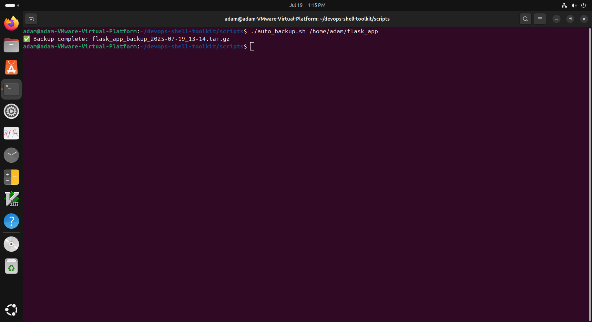
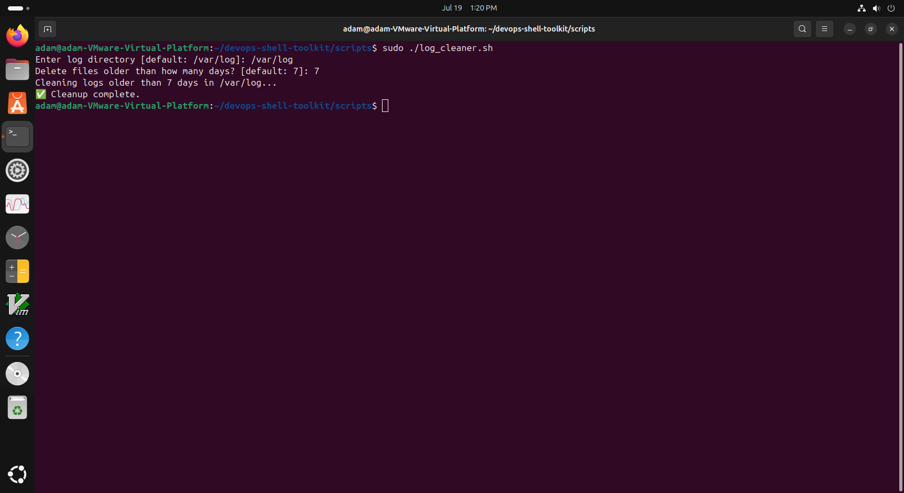
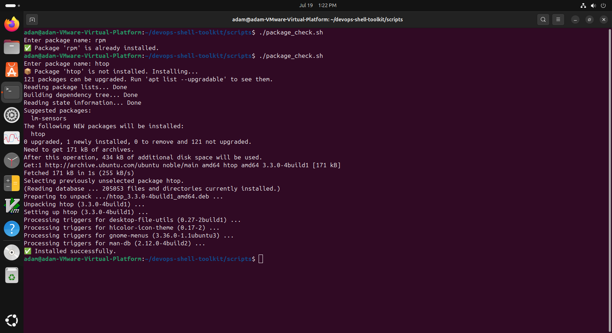
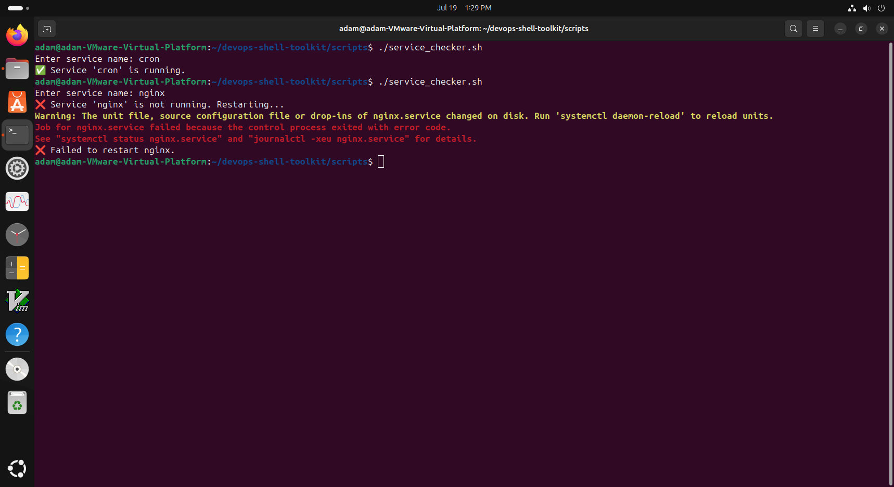
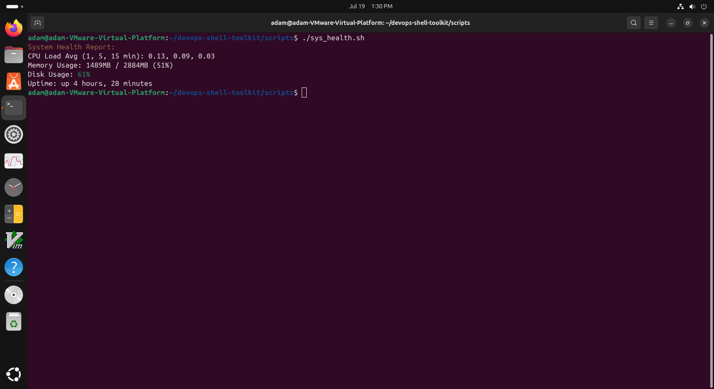
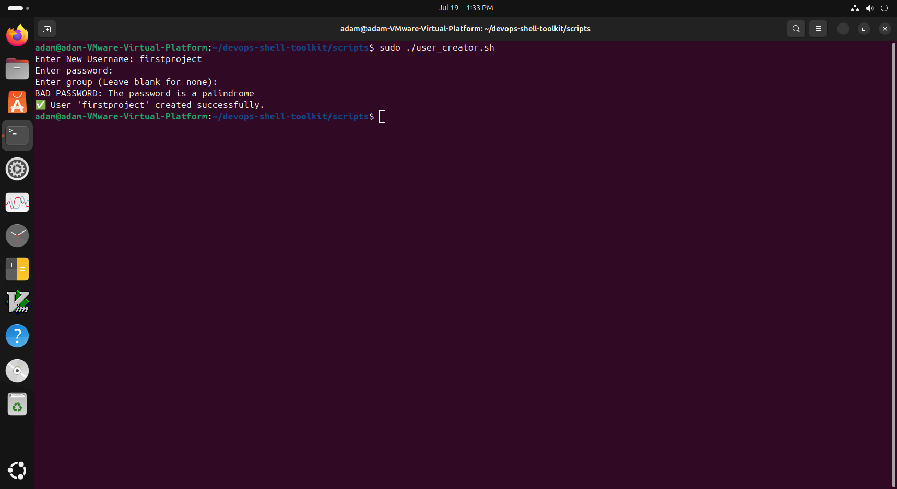

# 🧰 DevOps Shell Automation Toolkit

A set of Bash scripts to automate common system administration and DevOps tasks on a local Linux machine.

## 📁 Project Structure
```
devops-shell-toolkit/
├── docs
│   └── screenshots
│       ├── backup.png
│       ├── log_cleaner.png
│       ├── package_checker.png
│       ├── service_checker.png
│       ├── system_health.png
│       └── user_creator.png
├── README.md
├── LICENSE
└── scripts
    ├── auto_backup.sh
    ├── log_cleaner.sh
    ├── package_check.sh
    ├── service_checker.sh
    ├── sys_health.sh
    └── user_creator.sh
```

## ⚙️ Scripts Overview
| Script               | Description                                                                 | Usage Example                              |
|----------------------|-----------------------------------------------------------------------------|--------------------------------------------|
| `auto_backup.sh`     | Creates timestamped backups of a target directory.                          | `./auto_backup.sh /home/user`             |
| `log_cleaner.sh`     | Deletes system logs older than a set number of days.                        | `./log_cleaner.sh` (interactive prompts)  |
| `package_check.sh`   | Verifies if a package is installed and installs it if not.                  | `./package_check.sh vim`                  |
| `service_checker.sh` | Checks if a service is active; restarts it if not.                          | `./service_checker.sh sshd`               |
| `sys_health.sh`      | Displays CPU, RAM, disk usage, and system uptime.                           | `./sys_health.sh`                        |
| `user_creator.sh`    | Adds new users to the system with optional group assignment.                | `sudo ./user_creator.sh` (prompts)        |

## 🛠️ Prerequisites
Ensure the following tools are installed:
- `bash`, `tar`, `find`, `useradd`, `groupadd`, `chpasswd`, `id`, `getent`, `top`, `free`, `df`, `uptime`
Install on Ubuntu/Debian:
```bash
sudo apt update && sudo apt install -y coreutils findutils procps
```

## 🚀 Getting Started
1. Clone the repository:
   ```bash
   git clone https://github.com/adaamk/devops-shell-toolkit.git
   cd devops-shell-toolkit/scripts
   ```
2. Make scripts executable:
   ```bash
   chmod +x *.sh
   ```
3. Run a script (note: some require root privileges, e.g., `sudo ./user_creator.sh`):
   ```bash
   ./sys_health.sh
   ```

⚠️ **Note**: Scripts like `user_creator.sh` and `log_cleaner.sh` require `sudo` for system modifications.

## 🖼️ Screenshots
### 🔄 Backup Script


### 🧹 Log Cleaner


### 📦 Package Checker


### 🛠️ Service Checker


### 🧠 System Health Monitor


### 👤 User Creator


## 📜 License
This project is licensed under the MIT License. See the [LICENSE](LICENSE) file for details.
